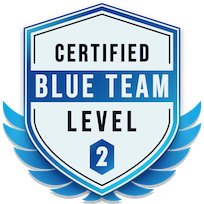

Hi, I’m a Blue Team cybersecurity specialist with a strong focus on security operations, incident response, and cloud security. I’m passionate about staying on top of the latest threat intelligence and love diving deep into threat actor campaigns to understand how they operate. 

Whether it's dissecting real-world attacks or strengthening defenses, I enjoy turning complex security challenges into clear, actionable insights. 

 

This blog is where I share what I learn, explore threat trends, and break down the tactics behind emerging cyber threats.

## Certifications

 
